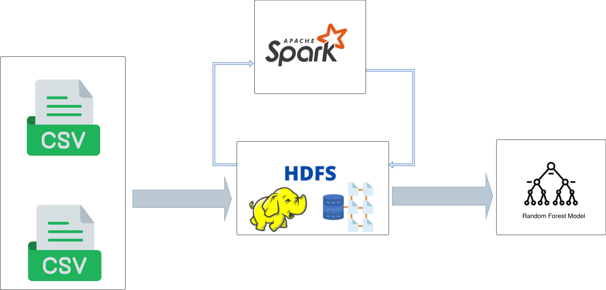
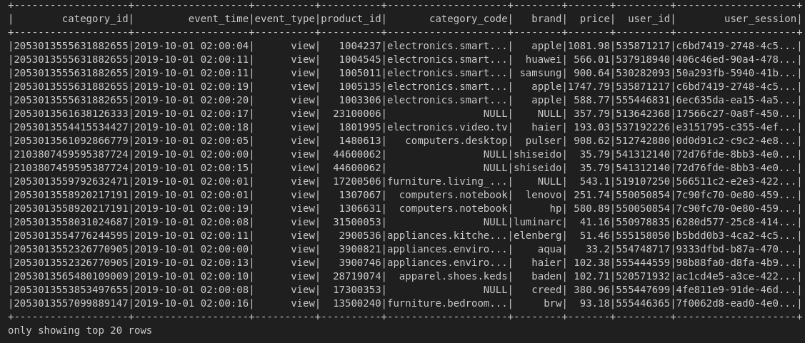
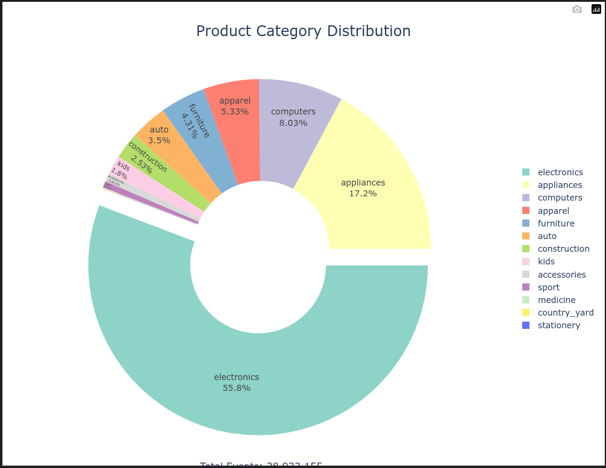
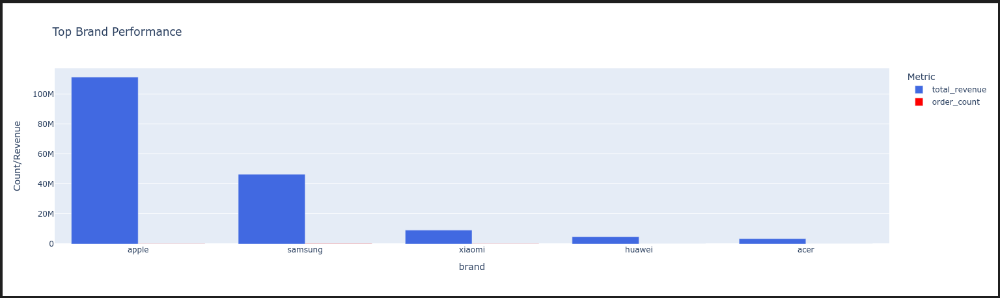
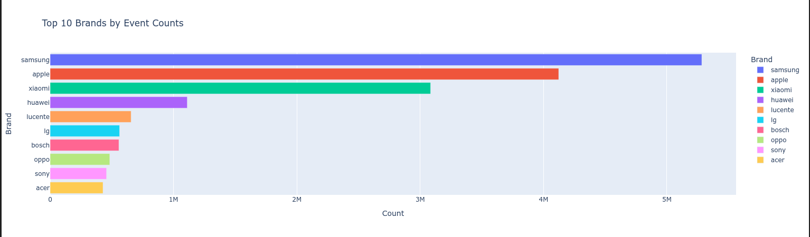
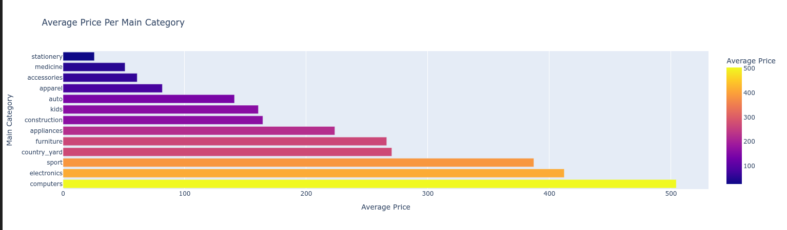
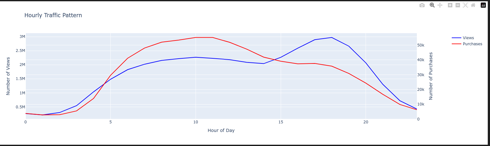
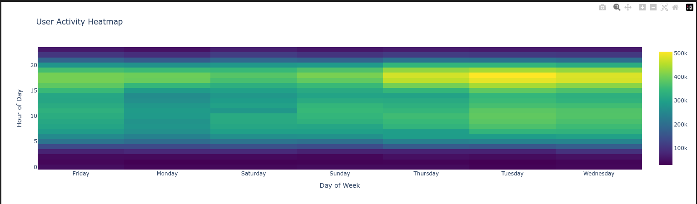
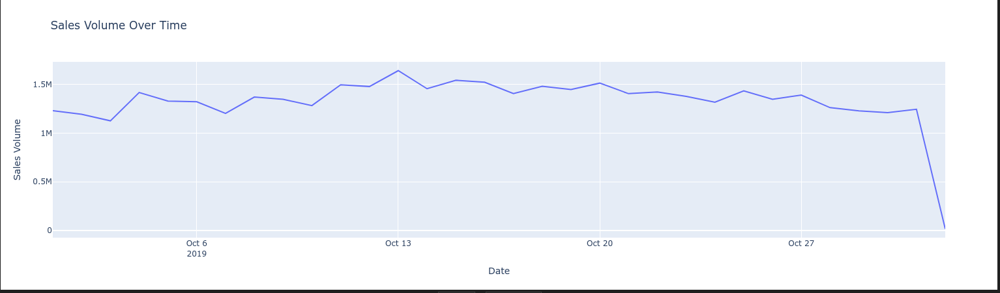

# E-Commerce Data Analysis with Hadoop and Spark

## Overview
This project demonstrates the process of setting up a Hadoop environment using Docker, loading e-commerce data into **HDFS**, and analyzing it using **PySpark** in a Jupyter Notebook. The primary focus is on showcasing distributed data processing for large-scale datasets.

This project aims to predict whether a user session in an eCommerce platform will result in a purchase. The model uses session-level aggregated data and a **Random Forest Classifier** to make predictions. The project is implemented in **PySpark** and is designed to handle large-scale eCommerce behavior data.

## Project Architecture

## Data set 

The dataset used in this project is **eCommerce behavior data from a multi-category store**, available on [Kaggle](https://www.kaggle.com/datasets/mkechinov/ecommerce-behavior-data-from-multi-category-store?select=2019-Oct.csv). It contains user interactions such as:
- **Views**: Product views
- **Carts**: Additions to cart
- **Purchases**: Completed purchases

Each row represents a user interaction, with columns like:
- `event_time`: Timestamp of the event
- `event_type`: Type of interaction (view, cart, purchase)
- `product_id`: ID of the product
- `category_id`: ID of the category
- `category_code`: name of the category
- `brand`: brand of the category
- `price`: Price of the product
- `user_id`: ID of user
- `user_session`: Unique session ID of each user

## Setup and Configuration

#### Step 1: Pull Docker Image
Use the following command to pull a pre-configured Hadoop-Spark-Pig-Hive Docker image:

%bash
docker pull suhothayan/hadoop-spark-pig-hive:2.9.2

#### Step 2: Run the Docker Container

%bash
docker run -it \
  -p 50070:50070 -p 8088:8088 -p 8080:8080 \
  -v /home/strang/Downloads/data:/data \
  -v /home/strang/hadoop-data:/hadoop-data \
  suhothayan/hadoop-spark-pig-hive:2.9.2 /bin/bash

#### Step 3: Configure HDFS Directories
Modify `hdfs-site.xml` to set the Namenode and Datanode directories:

%xml
<property>
  <name>dfs.namenode.name.dir</name>
  <value>/hadoop-data/nameNode</value>
</property>
<property>
  <name>dfs.datanode.data.dir</name>
  <value>/hadoop-data/dataNode</value>
</property>

#### Step 4: Format the Namenode and Start HDFS

%bash
hdfs namenode -format
export PATH=$PATH:/usr/local/hadoop/sbin
start-dfs.sh
jps

### Loading Data into HDFS

#### Step 5: Create HDFS Directory

%bash
hdfs dfs -mkdir -p /user/strang/ecommerce_data

#### Step 6: Load Data into HDFS

% bash
hdfs dfs -put /data/2019-Oct.csv /user/strang/ecommerce_data/
hdfs dfs -ls /user/strang/ecommerce_data

## Project Features

1-    `HDFS Setup`: Configured a distributed file system for scalable data storage.    
2-    `Data Processing`: Performed e-commerce data analysis using **PySpark**.      
3-    `Visualization`: Utilized Python libraries ex **Plotly** to create insightful charts for the data.    
4-    `ML model`: use a **Random Forest Classifier** to make predictions.    

## Interactive visualizations of e-commerce data set 

### Key Insights
**Category Distribution**
- `Electronics` dominates with 55.8% of activity  
- `Appliances` follows at 17.2%  
- `Computers` represent 8.03%  

### Key Insights 
**Brand Performance**

- `Apple` leads in revenue    
- `Samsung` leads in event counts    
- `Top 5 brands`: Samsung, Apple, Xiaomi, Huawei, Acer    

### Key Insights 
**User Behavior Patterns**

- Peak activity hours: `10AM-3PM`    
- Highest purchase conversion: `Morning hours`    
- Clear weekly patterns visible in user activity heatmap which is more active in `tuesday & wednesday`    

## Model

A **Random Forest Classifier** was trained to predict whether a session will result in a purchase. The model was implemented using **PySpark MLlib** and includes the following steps:
1. **Data Aggregation**: Grouped raw data by `user_session` to create session-level features.
2. **Feature Engineering**: Added derived features like ratios and handled missing values.
3. **Train-Test Split**: Split the data into 80% training and 20% testing sets.
4. **Model Training**: Trained a Random Forest model with 100 trees and a maximum depth of 5.
5. **Evaluation**: Evaluated the model using **ROC AUC**.

---

## Results
The model achieved an **ROC AUC of 0.8569**, indicating strong predictive performance. Below are the key metrics:

| Metric    | Score     |
|-----------|-----------|
| ROC AUC   | 0.8569    |

---

